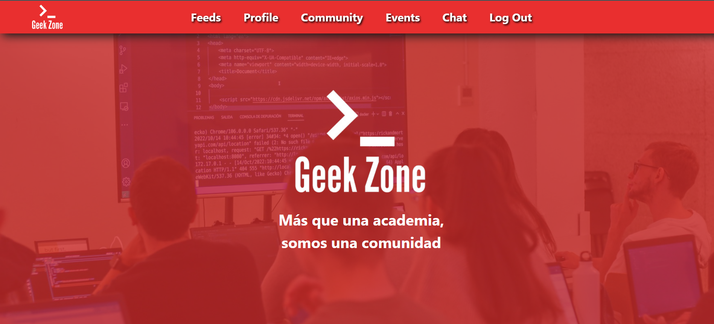

 ###### 

<h1 align="center"> 💥Geek Zone 💥</h1>
 
<div style="text-align:center;"> 
    
</div>
 
<br>
<p align="center"><a href="https://views.d6m2hk6zqt0er.amplifyapp.com/">https://views.d6m2hk6zqt0er.amplifyapp.com/</a></p> 

# Welcome to my frontend Geek Zone app using react
Developed as part of the final project in the Full Stack Developer Bootcamp at Geekshubs Academy.

<div style="text-align: center;">
    
</div>
<br> 

## Contenido

- [Introduction](#introduction)
- [Features](#features)
- [Problems and Possible Solutions](#🚧-problems-and-possible-solutions💡) 
- [Technologies Used](#technologies-used) 
- [Installation Steps](#installation-steps) 
- [Contributions](#contributions) 
- [Future Improvements](#future-improvements) 
- [License](#license)
- [Acknowledgments](#acknowledgments)
- [Author](#author) 
- [Contact](#contact) 

 <p align="center">_______________________________________________</p>

## Introduction 


The project I am planning to develop is called Geek Zone, an innovative virtual campus designed for students and teachers. This virtual environment facilitates connection among users, providing them the opportunity to exchange educational content, follow each other, engage in enriching conversations, and organize educational events. The platform aims to provide an interactive and collaborative experience, fostering the educational community and enhancing the learning process for all its users.

<div style="text-align: center;">
    
</div>

## Features

1.  <strong>Feed:</strong><br>
The feed is a dynamic section that displays the most recent posts and updates from the users you follow. You can share educational content, leave comments, and view real-time contributions from other users.

  <div style="text-align: center;">
    
  </div>

2. <strong>Profile: </strong><br>
The profile functionality allows users to manage and personalize their personal information. You can edit details such as your name, profile picture, address, and any other relevant information. You can also view your history of posts and activities.

3. <strong>Community:</strong><br>
The community section provides an overview of all registered users on the platform. You can explore profiles of students and teachers, see their interests and activities. Additionally, you have the option to follow other users to stay updated on their contributions.

4. <strong> Events:</strong><br>
Teachers can create educational events, such as lectures, seminars, or workshops. Students have the ability to explore these events and confirm their participation. The events functionality facilitates the organization and participation in planned educational activities.

5. <strong>Chat:</strong><br>
The chat feature enables direct communication between users. You can send messages to other students or teachers, create discussion groups, and share information instantly. This functionality promotes collaboration and real-time interaction among members of the educational community.

<div style="text-align: center;">
    
</div>
 
## Installation Steps:

1. Clone the Repository:
    ```
    git clone https://github.com/vincenzo2202/geek-zone-GH-frontend
    cd geek-zone-GH-frontend
    ```

2. Install Frontend Dependencies:
    ```
    npm install
    ```
3. Configure the Backend: 

- Create a MySQL database and configure the credentials in the geek-zone-GH-backend.

- Follow the backend installation instructions:

    https://github.com/vincenzo2202/geek-zone-GH-backend
 
4. Install Backend Dependencies:

    ```
        npm install
    ```

5. Configure Environment Variables:

- Create a .env file in the backend directory and configure the environment variables, including the JWT secret key.

    ``` js
        // DB Credentials
        PORT =   
        DB_HOST= 
        DB_USERNAME= ""
        DB_PASSWORD= ""
        DB_NAME=""
        DB_PORT=   
        //  JWT Secret  
        JWT_SECRET= "" 
    ```  

6. Start the Application:

- In the frontend directory, run npm run dev to start the frontend
- In the backend directory, run php artisan serve to start the backend server.

The application will be available at http://localhost:5173/ for the frontend and http://localhost:8000 for the backend.

Enjoy exploring the Geek Zone application!

## Contributions
Contributions are welcome. If you have improvement suggestions or find issues, feel free to open an issue or submit a pull request.

You can contribute in two ways:

1. Open an issue.
2. Fork the repository:
    - Create a new branch
    ```
    git checkout -b feature/your-username-improvement
    ```
   - Commit your changes
    ```
    git commit -m 'feat: improve X thing'
    ```
   - Push the branch

    ```
    git push origin feature/your-username-improvement
    ```
   - Open a Pull Request

 Thank you for your support!
 
## 🚧 Problems and Possible Solutions💡
- Responsive Design Issues in Intermediate Sizes

    <strong>Solution:</strong> mplement React Bootstrap to make the website responsive or apply additional @media queries to address the problem.

- There is an issue with the chat not updating until we manually refresh if we are the message recipients.

    <strong>Solution: </strong> Install socket.io and implement it for real-time updates in a live chat.
 
## Future Improvements
- Implement live chat.
- Implement storage to allow uploap.
- Implement a cloud to allow users to upload content through file uploads.

## Technologies Used
 
  <a target="_blank" rel="noopener noreferrer" href="https://github.com/devicons/devicon/blob/master/icons/mysql/mysql-original.svg"></a>&nbsp;
 <a target="_blank" rel="noopener noreferrer" href="https://github.com/devicons/devicon/blob/master/icons/html5/html5-original.svg"></a>&nbsp;
 <a target="_blank" rel="noopener noreferrer" href="https://github.com/devicons/devicon/blob/master/icons/css3/css3-plain-wordmark.svg"></a>&nbsp; 
 <a target="_blank" rel="noopener noreferrer" href="https://github.com/devicons/devicon/blob/master/icons/javascript/javascript-original.svg"></a>&nbsp;
  <a target="_blank" rel="noopener noreferrer" href="https://github.com/devicons/devicon/blob/master/icons/react/react-original-wordmark.svg"></a>&nbsp;
<a target="_blank" rel="noopener noreferrer" href="https://github.com/devicons/devicon/blob/master/icons/git/git-original.svg"></a>&nbsp;
<a target="_blank" rel="noopener noreferrer" href="https://github.com/devicons/devicon/blob/master/icons/git/git-original.svg"></a>&nbsp;
<a target="_blank" rel="noopener noreferrer" href="https://github.com/devicons/devicon/blob/master/icons/git/git-original.svg"></a>&nbsp;
<a target="_blank" rel="noopener noreferrer" href="https://github.com/devicons/devicon/blob/master/icons/git/git-original.svg"></a>&nbsp;
<a target="_blank" rel="noopener noreferrer" href="https://github.com/devicons/devicon/blob/master/icons/git/git-original.svg"></a>&nbsp;
<a target="_blank" rel="noopener noreferrer" href="https://cdn.worldvectorlogo.com/logos/jwt-3.svg"></a>&nbsp;
 
## License

This project is under the MIT License. Please refer to the LICENSE file for more information.
  
## Acknowledgments

This project has been made possible thanks to the hard work of my teachers Daniel Tarazona and David Ochando, who not only share their knowledge but also instill enthusiasm in us for what we are developing.
 
<strong>Daniel Tarazona</strong><br>
<a href="https://github.com/datata">

</a>
  
<strong>David Ochando</strong><br>
<a href="https://github.com/Dave86dev">

</a> 
  
## Author

- **Vincenzo Donnarumma Veitia**

## Contact   
<a href = "mailto:vincenzodonnarumma22@gmail.com"  target="_blank">

</a>
<a href="https://github.com/vincenzo2202"  target="_blank">
    
</a>  
<a href="https://www.linkedin.com/in/vincenzo2202/" target="_blank">

</a> 

## Pictures 

 

 <div style="text-align: center;">
    
</div>
<div style="text-align: center;">
    
</div>
<div style="text-align: center;">
    
</div>
<div style="text-align: center;">
    
</div>
<div style="text-align: center;">
    
</div>
<div style="text-align: center;">
    
</div>
 